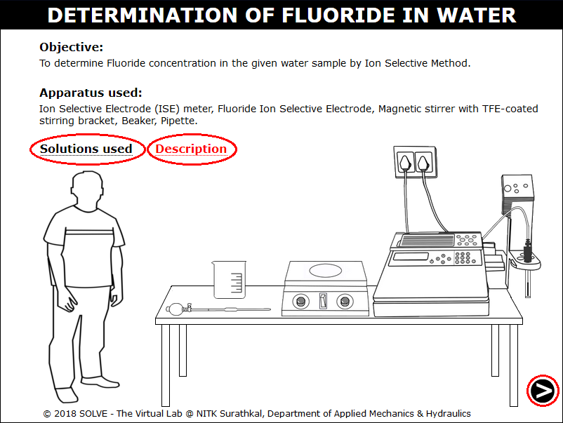
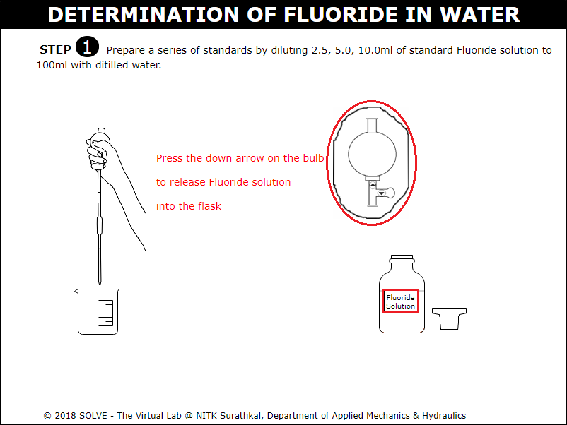
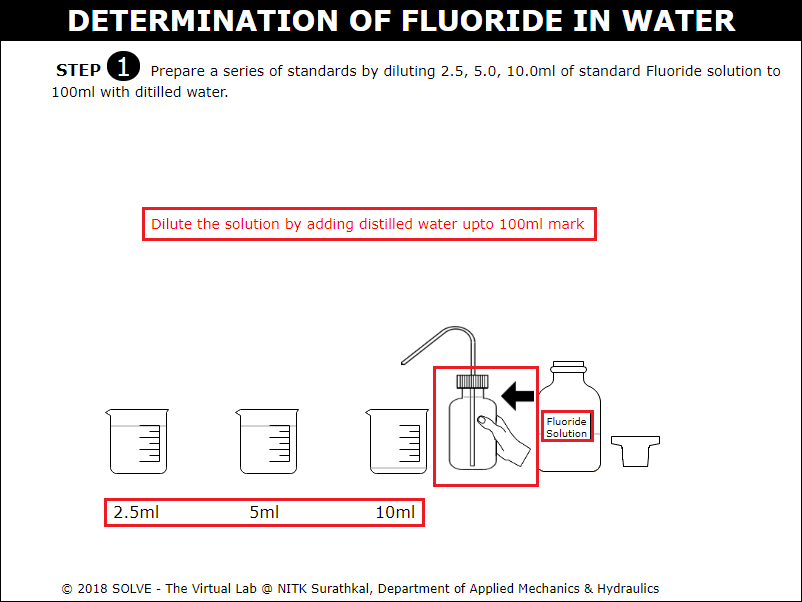
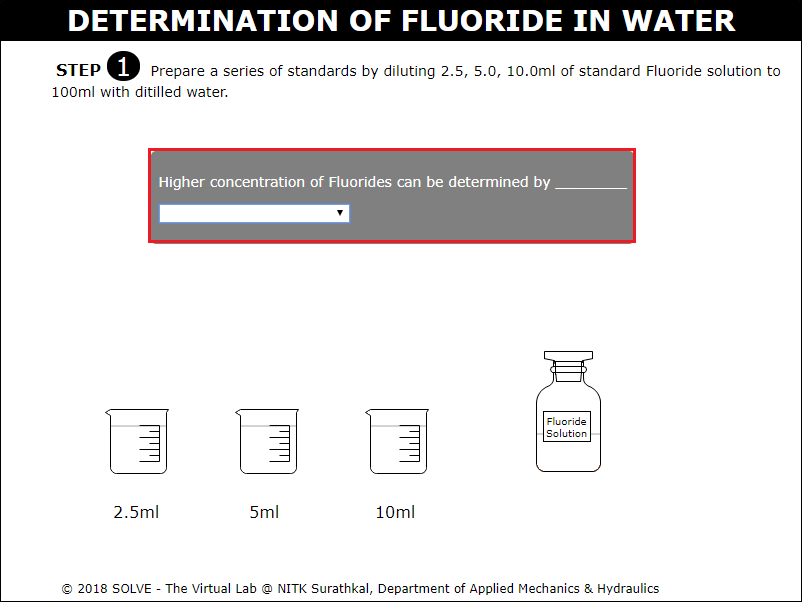
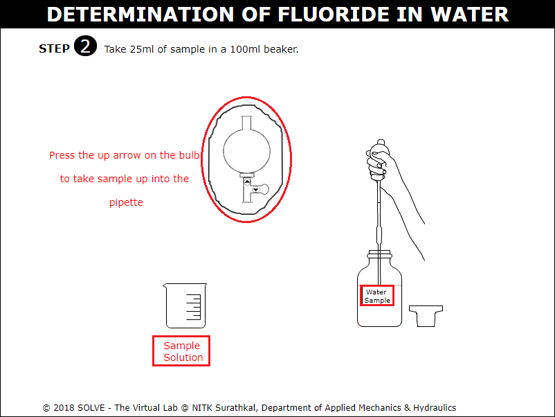
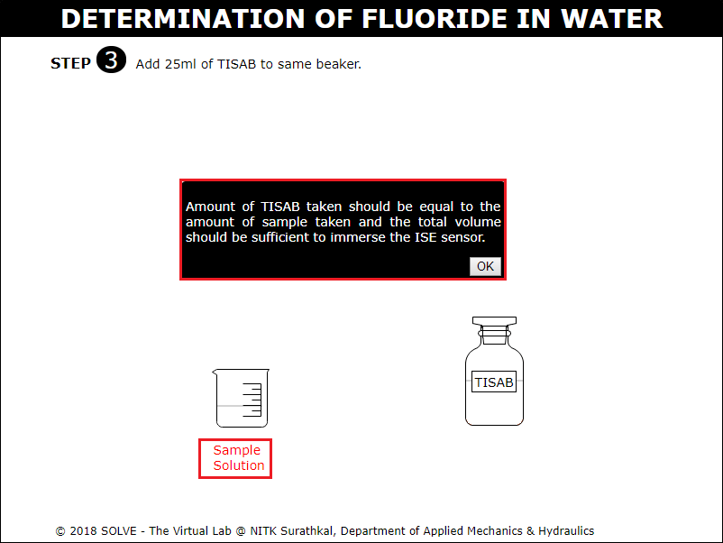
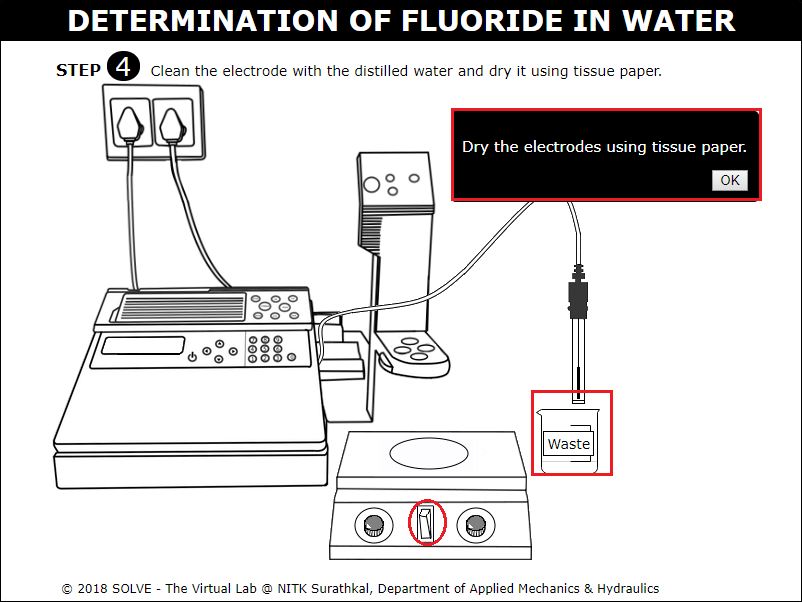
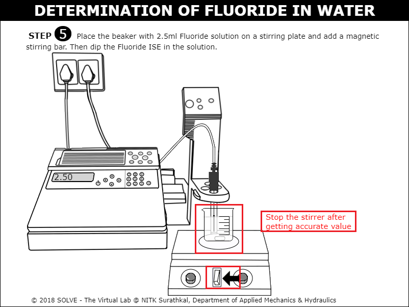
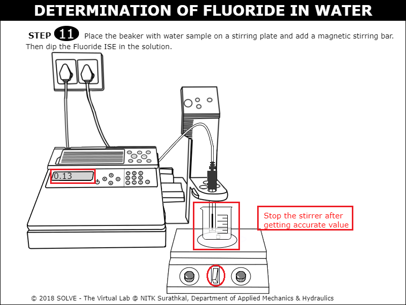
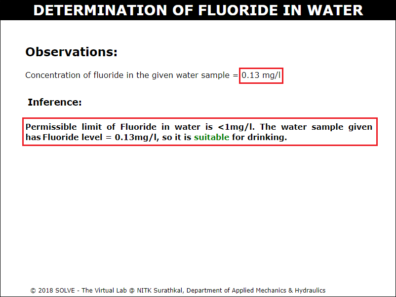

#### These procedure steps will be followed on the simulator

1. When you click on Fluoride in Water simulation file, a new window will open as shown below, hover on "Description" and "Solutions used" label to understand the terminologies and reagents used in the experiment. Click on NEXT button to proceed. 
 

2. Click on the graduated pipette to take 2.5, 5.0 and 10.0ml of standard Fluoride solution in a beaker. 
 

3. Click on the distilled water bottle to add it to the conical flask. 
 

4. Answer the question by selecting the correct answer, click on Next button to proceed with the simulation. 
 

5. Click on the graduated pipette to add 100ml of sample water to prepare sample solution. 
 

6. Click on the graduated pipette to add 25ml of TISAB solution to sample solution. 
 

7. Go through the instruction given, then click on OK to proceed with the simulation. 
 

8. Clean the electrodes with distilled water, then go through the instruction and click on OK to dry the Fluoride ISE electrodes using tissue paper. 
 

9. Click on the beaker with 2.5ml Fluoride solution to place it on a stirring plate and add a magnetic stirring bar. Then dip the Fluoride ISE electrodes in the solution, then repeat the same for 5.0 and 10.0ml Fluoride solution. 
 

10. Click on the beaker with water sample to place it on a stirring plate and add a magnetic stirring bar. Then dip the Fluoride ISE electrodes in the solution to determine the Fluoride concentration of it. 
 

11. Go through the Inference drawn from the obtained result. 
 
